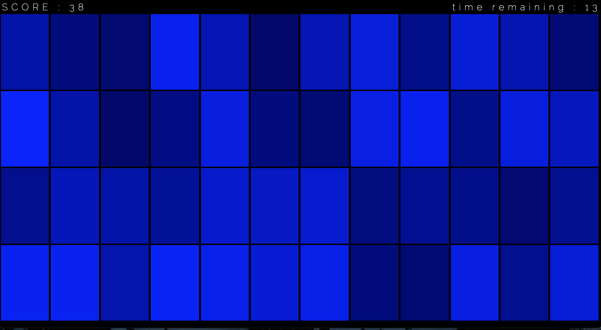
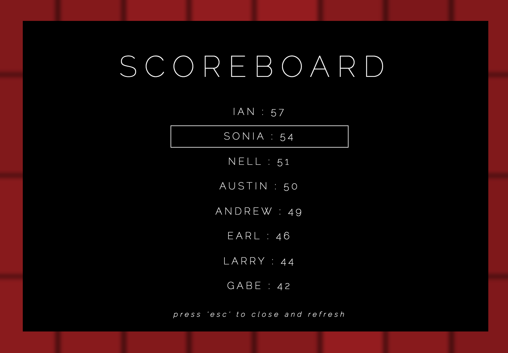

# Color Theory

## Test your color skills by clicking on the darker boxes sandwiched between two lighter ones in this interactive game built with HTML5, CSS, and jQuery.

---

### Summary

Color Theory randomly generates different shades of red, green, or blue boxes, and animates the boxes within each row. The purpose of the game is to click on boxes that are darker than the two boxes to its left and right. As the levels progress the difference in color shade becomes smaller and more rows are generated. Color theory is 9 levels long, and each level is 20 seconds long. At the end of the game your score is saved in local storage and displayed on scoreboard sorted by high score. Color Theory is best played while listening to some chill ambient music: (https://soundcloud.com/tycho/sets/tycho-dive).





---

### Instructions

* Click on the darker boxes sandwiched between two lighter ones
* Press 'p' to pause (since I know sitting still for 3 minutes is extremely difficult)
* Enter your name at the end of the game to see your score and the scoreboard
* Press 'esc' to exit the scoreboard and refresh

---

### Sample Code

As boxes on the screen are clicked, Color Theory runs a function that checks the RGB value of the box that was clicked, and compares it to the box to the left of it and the box to the right of it, and then the box fades out. If the box is darker, then you gain a point, if the box is lighter you lose a point. After the box fades out, a new box is generated with another random color and placed at the end of the row it was removed from.

```javascript
function boxClick(){
              game.id = this.id; // id of box clicked
              var rowValue = $(this).parent().prop('id');
              var gameIdSelector = $('#' + game.id);
              var nextBox = $(gameIdSelector).next();
              var previousBox = $(gameIdSelector).prev();
              var clickedColorArray = rgbToArray($(gameIdSelector).css('backgroundColor'));
              var nextBoxColorArray = rgbToArray(nextBox.css('backgroundColor'));
              var previousBoxColorArray = rgbToArray(previousBox.css('backgroundColor'));
                  if(game.colorButtonChoice === 'blue'){
                      var i = 2;
                  }
                  else if(game.colorButtonChoice === 'green'){
                      var i = 1;
                  }
                  else if(game.colorButtonChoice === 'red'){
                      var i = 0;
                  }
              game.clickedColor = parseInt(clickedColorArray[0][i]);
              game.nextColor = parseInt(nextBoxColorArray[0][i]);
              game.previousColor = parseInt(previousBoxColorArray[0][i]);
              compareColors();
              $(gameIdSelector).fadeOut(500, function(){
                  this.remove();
                  setBackgroundColors();
                  var rowToAppendTo = rowValue.split('');
                  var newDiv = $('<div class="box"/>');
                  $('#'+ rowValue).append(newDiv);
                  $(newDiv).css('background-color', game.colorRandomFunction);
                  $(newDiv).css('display', 'inline');
                  $(newDiv).prop('id', rowToAppendTo[4] + '-' + game.newBox);
                  $(newDiv).on('click', game.boxClick);
                  game.newBox++;
              });
          }
```

---

### Thought Process  /  Ideas  /  Etc.

I wanted to create a very visual and aesthetically pleasing game, which is how I gravitated toward manipulating colors and boxes. The game is meant to be chill and cathartic. Initially I was going to work with completely random colors populating the page, but as I experimented with that I realized that the contrast between all the different colors was jarring and aggressive, and thus I ended up working solely in shades of red, green, or blue.

---

### Improvements  /  Moving Forward

* Music in the background that can be toggle on or off depending on user preference
* Game and scoreboard hosted on server
* Animate boxes in a circle or spiral rather than just left
* Option for number of levels to play
* Option to play a specific level indefinitely without a score
